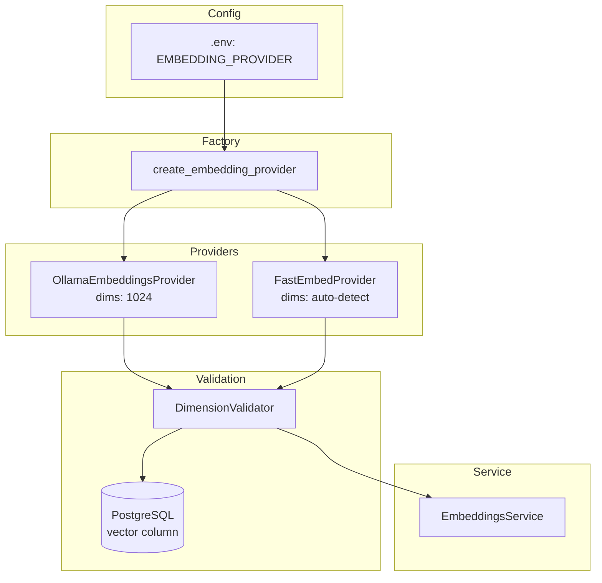

# Plano de Implementação - Avaliação e Otimização de Embeddings

## Problema

A ingestão de documentos via Ollama é lenta (~15-20min para 261 páginas) devido a chamadas HTTP individuais. A solução é implementar FastEmbed (ONNX) como alternativa mais rápida, com um framework de avaliação para comparar qualidade.

## Requisitos

- **Escopo completo**: FastEmbedProvider + factory + migration + framework de avaliação + benchmark
- **Dimensão configurável com validação**: Sistema detecta dimensão do provider e valida contra o banco, avisando se precisar de migration
- **Banco recriável**: Ambiente de dev, pode re-ingerir documentos
- **Golden set baseado em `fixtures/reg_interno.pdf`**

## Arquitetura Proposta

## Solução

1. Criar `FastEmbedProvider` que implementa a interface `EmbeddingsProvider` existente
2. Criar factory que seleciona provider via config (`EMBEDDING_PROVIDER=fastembed|ollama`)
3. Adicionar validação de dimensão na inicialização (provider vs banco)
4. Criar migration parametrizada para alterar dimensão do vetor
5. Criar golden set com perguntas/respostas baseadas no regimento
6. Criar script de benchmark que mede hit rate, MRR, e tempo de ingestão/busca

---

## Breakdown de Tasks

### Task 1: Adicionar dependência FastEmbed e atualizar config

- **Objetivo**: Preparar o projeto para suportar FastEmbed
- **Implementação**:
  - Adicionar `fastembed>=0.2.0` ao `requirements.txt`
  - Adicionar novas variáveis em `Settings`: `embedding_provider` (default "ollama"), `embedding_dimensions` (computed/readonly)
- **Testes**: Teste unitário validando que config carrega corretamente com novos campos
- **Demo**: `python -c "from app.core.config import get_settings; print(get_settings().embedding_provider)"` retorna "ollama"

### Task 2: Implementar FastEmbedProvider

- **Objetivo**: Criar provider de embeddings usando FastEmbed/ONNX
- **Implementação**:
  - Criar `app/embeddings/fastembed_provider.py`
  - Implementar interface `EmbeddingsProvider` (embed, embed_batch, embed_batch_async, dimensions)
  - Auto-detectar dimensão do modelo carregado
  - Implementar batch nativo (sem HTTP)
- **Testes**: Testes unitários com mock do TextEmbedding, teste de integração opcional com modelo real
- **Demo**: Teste passa mostrando que provider gera embeddings com dimensão correta

### Task 3: Criar factory de providers

- **Objetivo**: Centralizar criação de providers baseado na config
- **Implementação**:
  - Criar `app/embeddings/factory.py` com `create_embedding_provider()`
  - Selecionar provider baseado em `settings.embedding_provider`
  - Atualizar `EmbeddingsService` para usar factory por padrão
- **Testes**: Testes verificando que factory retorna provider correto para cada config
- **Demo**: Mudar `.env` para `EMBEDDING_PROVIDER=fastembed` e verificar que sistema usa FastEmbed

### Task 4: Implementar validação de dimensão

- **Objetivo**: Detectar mismatch entre dimensão do provider e do banco
- **Implementação**:
  - Criar `app/embeddings/validator.py` com `validate_embedding_dimensions()`
  - Consultar dimensão da coluna `embedding` no banco via SQL
  - Comparar com `provider.dimensions`
  - Levantar erro claro se mismatch, indicando comando de migration
- **Testes**: Testes com mock do banco simulando match e mismatch
- **Demo**: Forçar mismatch e ver mensagem de erro clara

### Task 5: Criar migration parametrizada para dimensão

- **Objetivo**: Permitir alterar dimensão do vetor quando trocar de modelo
- **Implementação**:
  - Criar migration `003_update_embedding_dimension.py`
  - Usar variável de ambiente `TARGET_EMBEDDING_DIMS` para definir nova dimensão
  - Recriar coluna, índice HNSW, view e function `search_similar_chunks`
  - Documentar que requer re-ingestão após rodar
- **Testes**: Teste de integração rodando migration up/down
- **Demo**: Rodar `TARGET_EMBEDDING_DIMS=384 alembic upgrade head` e verificar coluna alterada

### Task 6: Criar golden set de avaliação

- **Objetivo**: Dataset de perguntas/respostas para medir qualidade do retrieval
- **Implementação**:
  - Criar `tests/evaluation/golden_set.py`
  - Definir estrutura: question, expected_chunks (keywords), expected_doc_type
  - Criar 15-20 perguntas baseadas no `fixtures/reg_interno.pdf`
  - Incluir perguntas sobre horários, regras, animais, obras, etc.
- **Testes**: Teste básico validando estrutura do golden set
- **Demo**: Listar perguntas do golden set

### Task 7: Implementar métricas de retrieval

- **Objetivo**: Calcular hit rate, MRR e precision@k
- **Implementação**:
  - Criar `tests/evaluation/metrics.py`
  - `RetrievalMetrics` dataclass com hit_rate, mrr, precision_at_k
  - Funções para calcular cada métrica dado resultados e expected
- **Testes**: Testes unitários com casos conhecidos (100% hit, 0% hit, parcial)
- **Demo**: Teste mostrando cálculo correto de métricas

### Task 8: Criar script de benchmark

- **Objetivo**: Comparar modelos de embedding lado a lado
- **Implementação**:
  - Criar `scripts/benchmark_embeddings.py`
  - CLI com opções: --provider, --model, --document
  - Fluxo: ingerir documento → rodar golden set → calcular métricas → exibir tabela
  - Usar Rich para output formatado
  - Medir tempo de ingestão e tempo médio de busca
- **Testes**: Teste com mocks validando fluxo completo
- **Demo**: Rodar benchmark e ver tabela comparativa

### Task 9: Integrar validação no startup da aplicação

- **Objetivo**: Garantir que sistema não inicia com dimensão incompatível
- **Implementação**:
  - Adicionar check de dimensão no startup da API (`app/api/main.py`)
  - Adicionar check no CLI antes de operações de ingestão/query
  - Log warning se usando Ollama (lento) vs info se usando FastEmbed
- **Testes**: Teste E2E verificando que API não sobe com mismatch
- **Demo**: Tentar iniciar API com mismatch e ver erro claro

### Task 10: Atualizar documentação e .env.example

- **Objetivo**: Documentar novo sistema de providers e como fazer benchmark
- **Implementação**:
  - Atualizar `.env.example` com novas variáveis
  - Atualizar README.md seção de configuração
  - Adicionar seção sobre benchmark de embeddings
  - Documentar processo de migração de dimensão
- **Testes**: N/A (documentação)
- **Demo**: README mostra como trocar provider e rodar benchmark
